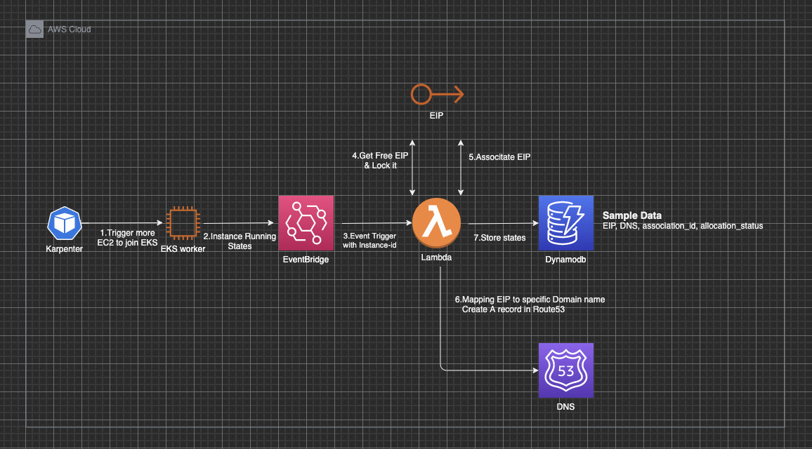

# eip-and-dns-auto-binding-for-karpenter-worker

## Background

Applications that require high bandwidth and low latency, such as live-streaming server, may require one Pod per Kubernetes/EKS worker. These Pods provide services directly through the host network using an Elastic IP (EIP), rather than going through Ingress or ELB. With this solution, our goal is to automatically assign an EIP and generate a mapped Route53 DNS record for each Karpenter-managed EKS worker. Then, we store the bound information of Pod/worker in a central DynamoDB for scheduling, so as to automate the entire server onboarding process.

## Solution introduction

A straight forward way is to embed the script of EIP binding, DNS creation, record store into userdata of Karpenter worker template. Howerver, there are two consideratble shortages in this scenario.

*  The IAM policy of worker is too much. For example, it needs EIP access, DDB access, route53 access rights and so on.
*  It is not elastic and coupled everything into the intial script of AMI.

Under that, a more secure and decoupled solution is right there



##### Data flow
* If there are any unschduled pods, Karpenter will launch groups of new EKS workers
* Evenbridge will listen on "Instance state change" notification
Once the instance states comes to running, a lambda function will be triggered.
* Lambda will first get all unassociated EIP with specific tags. Then, assign EIP to the instance
Secondly, lambda will create a DNS record based on specific mapping policy
* Finally, lambda will store EIP, DNS, associate_id and allocation status into Dynamodb, and then schedule server could utilize server information stored in       Dynamodb for Live-streaming serving.

## How to deploy

#### Prerequsite
* Attach related tags to karpenter node template. Please refer to: https://karpenter.sh/v0.26.1/concepts/node-templates/
* Attach team/app related tags to EIP
* Ensure there are enough EIP(or BYOIP) allocated
* Ensure there is CDK V2 installed(not required if you choose option2)


**Either** choose a one-stop option 1 or step by step option 2.
#### Option 1: CDK based deployment

Clone repo 
```
git clone git@ssh.gitlab.aws.dev:zhenyin/eip-and-dns-auto-binding-for-karpenter-worker.git
cd eip-and-dns-auto-binding-for-karpenter-worker/
```
Make modification on config file according to related environments settings
```
% vim config/config.yaml

# suffix refer to the mapping logic between ip and dns name
route53:
  host_zone_id: "example_id"
  suffix: "example.info"
lambda:
  # target worker and its application/team tag according to prerequsited required
  ec2_tag: 
    team: "example_tag"
  # target EIP and its application/team tag according to prerequsited required
  eip_tag:
    team: "example_tag" 
# CDK will add extra prefix to the table name    
dynamodb:
   table: "example_table_for_record_store"  
```   
Deployment
> Please ensure you have aws credentials configured and CDK installed.
```
$ cd auto_eip_route53_binding_karpenter/
$ CDK bootstrap
$ CDK synth
$ CDK deploy
```


#### Option 2: Manual deployment

1. Create a Public Host-Zone on Route53
2. Create a Dynamodb Table called "record_table" with below design
    ```
        'partitionKey': {
            'S': EIP,
        },
        'sortkey': {
            'S': DNS_Record,
        },
        'AssociationId': {
            'S': AssociationId,
        },
        'allocated': {
            'BOOL': Status,
        },
    ```
3. Upload lambda function 
   
   User could just upload lambda_logic.py under eip-ns-auto-binding-karpenter/lambda/to lambda function with python3.8 or above.

   Also, adjust below enviroment parameters as required
   * execution role
     * policy to access ddb, route53, EIP
   * exectuion durarion
     * most of the work will be finished within 1minutes

   Please ensure adjust below parameter in main.py as your enviroments required
    * ec2_tag  : target worker and its application/team tag
    * eip_tag  : target EIP and its application/team tag
    * host_zone_id : target hosted zone
    * table_name : DDB table to store binding records
    * suffix : mapping suffix
  
4. Eventbridge rule with patten like blow
  
    Event Pattern
    ```
    {
    "source": ["aws.ec2"],
    "detail-type": ["EC2 Instance State-change Notification"],
    "detail": {
      "state": ["running"]
    }
    }
    ```
    > ![Important] Tags of the instance will not be passed for now so that every instance run will trigger the rule, and the filter work needed to be done in following lambda function

  and then choose target to the lambda function created in step 3.


## Further enhancement
* Alternative solution, replace eventbridge with APIGateway so that embed only a http call into the user data to limit the invocations.
* For the scaling in mechanism, there are lots of factor will be involved. A common flow is that monitoring stack scratch the http metrics from pod, say no traffic right there, then some internal controller could delete the target pods which in turn the worker will be dismissed automatically. There are two time slots to do the DNS dissociation works.
  
  * Using pod finalizer to trigger the dismiss
  * Use the same pattern as in this solution
  
  I would suggest the first option as it could dismiss the DNS and EIP in **more timely** manner and also **narrow down** the triggered times as Tag can not pass limitation right there.


